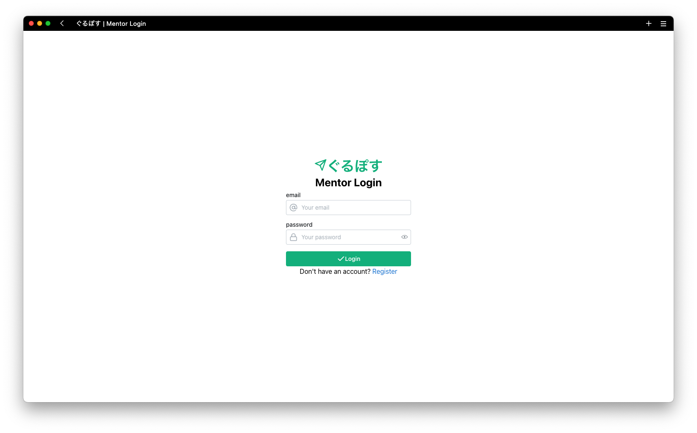
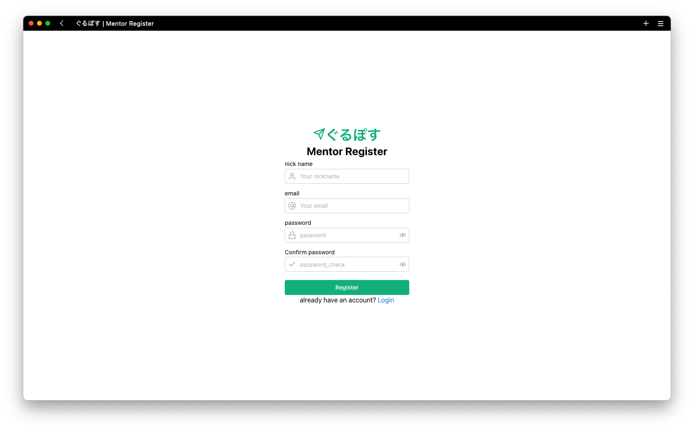
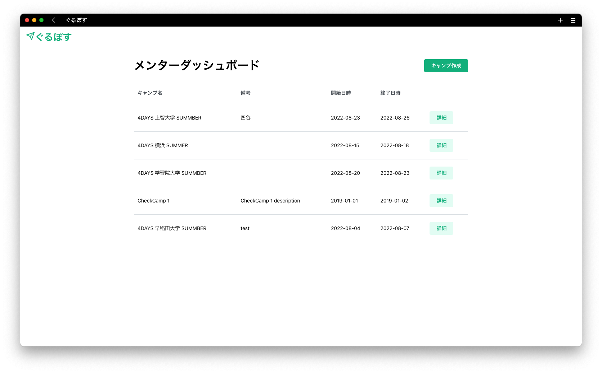
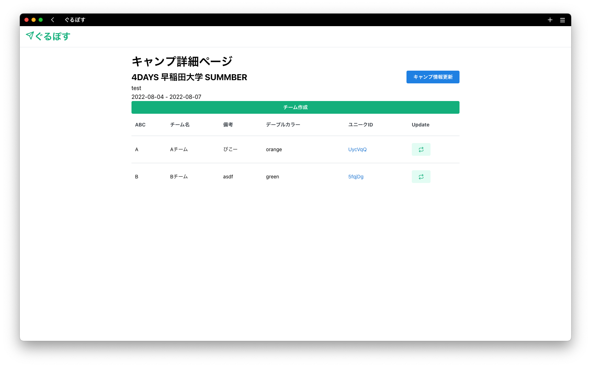
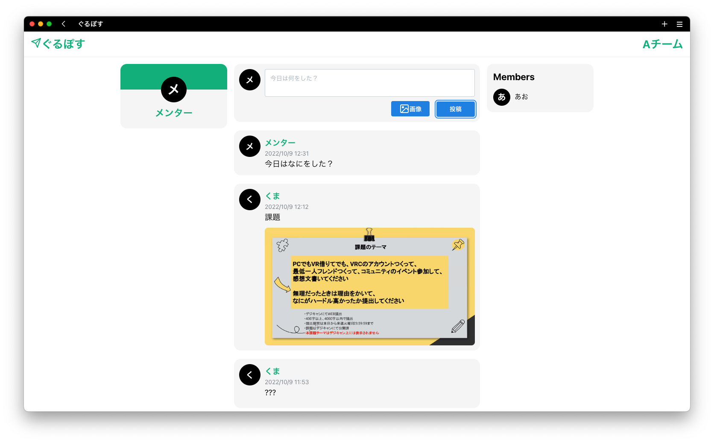
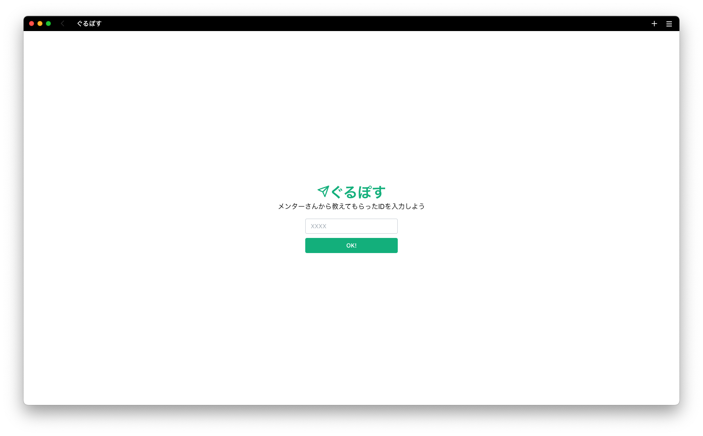
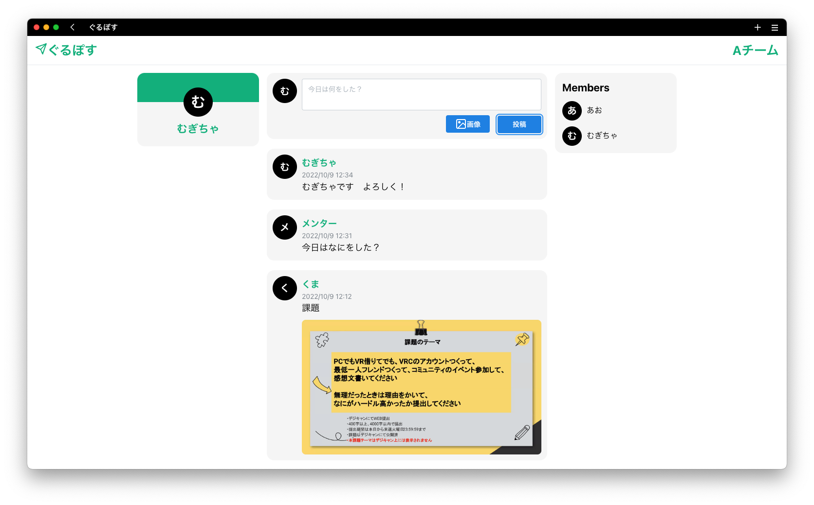

# ぐるぽす

キャンプでの班内小規模SNSです。

## 使い方
### メンター向け
1. メンターは、 https://guruposu.aovoq.work/mentor にアクセスします。
2. ログインしていない場合はログインページにリダイレクトされるため、ログインもしくは、新規登録を行います。
3. ログイン後、キャンプダッシュボードが表示されます。
4. ダッシュボードにてキャンプを作成するか、既存のキャンプ詳細ページに移動します。
5. キャンプ詳細ページにて、班を作成するか、班の固有IDをメモします。
6. そのIDをメンバーに伝えてください。

### メンバー向け
1. メンバーは、メンターから教えてもらったIDを、 https://guruposu.aovoq.work にアクセスして入力するか、ID付きのURLにアクセスしてください。
2. ニックネームと、４桁の数字のパスコードを入力して登録を行ってください。
3. 自動でログインされ、タイムラインが表示されます。
4. 今日の進捗を投稿しましょう。

## 画像
### メンター向け
1. メンターログイン 
2. メンター登録 
3. キャンプダッシュボード 
4. キャンプ詳細ページ 
5. タイムライン 

### メンバー向け
1. インデックス 
2. メンバー登録、ログイン 
3. タイムライン 
